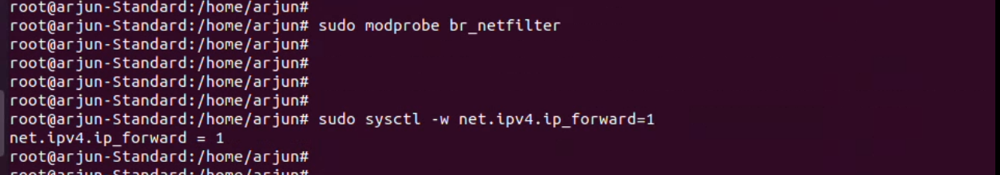

## <center>**MetalLB setup on Kubernetes cluster**</center>


    
### **[1 . Requirement of MetalLB]()**
    

In the bare metal deployment kubernetes does not provide the functionality of creating Load Balancer on service by default
    
  ### **[2 . Environment detail :]()**
    
   OS: Ubuntu 20.04.6 LTS
    
  ### **[3 . List of tools and technologies:]()**
    
  - Kubernetes
  - MetalLB
  - Podman/Docker 
    
    #### **[Kubernetes ]()**
    
    Think of Kubernetes as a smart manager for your applications. Imagine you have lots of little workers (containers) who need to run your programs. Kubernetes is like a boss who organises and manages these workers efficiently. It makes sure your programs are running, scales them when needed, and even replaces them if they fail.
    
    #### **[MetalLB ]()**
    
    Picture MetalLB as a friendly valet for your apps in Kubernetes. Normally, LoadBalancers help direct internet traffic to different services, like websites or apps. MetalLB does this even if you're not on a big cloud service (like Amazon or Google). It helps your Kubernetes apps get the right traffic and lets them talk to the world.
    
## **[4 . Command for the setup or configuration :]()**
    
 ### **[[a] Install Kubernetes]()**
    
  Here's a general outline of the steps you would follow to install Kubernetes on Ubuntu:

  
  **This command asks for the current user's password rather than root.**
```bash
    sudo su
```
- sudo su is used to become the superuser in Unix-based systems, granting elevated administrative privileges. It often requires the user's password for authentication.


**Step 1 .Update the system's package list and install necessary dependencies using the following commands:**
    
```bash
    sudo apt-get update
```
 - sudo apt-get update is a command in Debian-based Linux systems used to refresh the local package repository information, ensuring the system has the latest data about available software packages and their versions.


  ---
    
  **Step 2 :** **Install Docker :** Kubernetes relies on Docker for containerization. Install Docker using the following commands:
    
  ```bash
    sudo apt-get install docker.io
  ```
  - The apt-get install command in Debian-based Linux systems is used to install software packages from the distribution's repositories. You typically follow this command with the name of the package you want to install, like **apt-get install docker.io.**


---

```bash
    sudo systemctl start docker
```
  - The sudo systemctl start docker command is used to start the Docker service in a Linux system, allowing you to run containerized applications.


```bash
    sudo systemctl status docker
```
- The command sudo systemctl status docker is used to check the status and information of the Docker service in a Linux system. It provides details about whether Docker is running and its current status, as well as other related information.


  
---
    
  **Step 3 :** **Install kubeadm, kubelet, and kubectl :** These are the essential components of Kubernetes.

    
  ```bash
    sudo apt-get install -y apt-transport-https curl
  ```
 - The command sudo apt-get install -y apt-transport-https curl is used in Debian-based Linux systems to install the apt-transport-https and curl packages with automatic "yes" responses to prompts, allowing you to securely retrieve data from repositories and download files from the internet.


---

```bash
    curl -s https://packages.cloud.google.com/apt/doc/apt-key.gpg | sudo apt-key add -
```
- This command fetches a GPG key from a URL and adds it to the system's trusted keys for package verification in Debian-based Linux systems.


    
```bash
    echo "deb https://apt.kubernetes.io/ kubernetes-xenial main" | sudo tee /etc/apt/sources.list.d/kubernetes.list
```
```bash
    sudo apt-get update
  ``` 
 - This command echoes the repository line "deb https://apt.kubernetes.io/ kubernetes-xenial main" into the kubernetes.list file using sudo tee, effectively adding the Kubernetes repository to the system's package sources. It requires superuser privileges for write access to the system file.


  ```bash
    sudo apt-get install -y kubelet kubeadm kubectl 
  ``` 
  - The command sudo apt-get install -y kubelet kubeadm kubectl is used in Debian-based Linux systems to install the Kubernetes components kubelet, kubeadm, and kubectl with automatic "yes" responses to prompts.


---
    
  **Disable swap using the following command:**
    
  ```bash
    sudo swapoff -a
  ```
  - The command sudo swapoff -a is used to deactivate or turn off all swap partitions on a Linux system, effectively disabling swap space.


   **Install vim text editor:**

  ```bash
  sudo apt-get install vim
  ```
 - The command sudo apt install vim is used to install the Vim text editor on a Debian-based Linux system. It requests superuser privileges (sudo) to execute the installation of Vim.


  ---
  **If there are any swap entries in the /etc/fstab file, remove them using a text editor such as vim:**
    
  ```bash
    sudo vim /etc/fstab
  ```
  - The command sudo vim /etc/fstab opens the /etc/fstab file for editing using the Vim text editor with superuser privileges, allowing you to make changes to the system's file table and manage file system mount points.

  Before changes **[/swapfile]**

      # /etc/fstab: static file system information.
      #
      # Use 'blkid' to print the universally unique identifier for a
      # device; this may be used with UUID= as a more robust way to name devices
      # that works even if disks are added and removed. See fstab(5).
      #
      # <file system> <mount point>   <type>  <options>       <dump>  <pass>
      # / was on /dev/vda5 during installation
      UUID=03f31c10-c7dd-4f6a-8511-d5328e3341db /               ext4    errors=remount-ro 0       1
      # /boot/efi was on /dev/vda1 during installation
      UUID=8304-4F6B  /boot/efi       vfat    umask=0077      0       1
      /swapfile                                   none            swap    sw              0       0
      
    

  After changes **[#/swapfile]**

        # /etc/fstab: static file system information.
        #
        # Use 'blkid' to print the universally unique identifier for a
        # device; this may be used with UUID= as a more robust way to name devices
        # that works even if disks are added and removed. See fstab(5).
        #
        # <file system> <mount point>   <type>  <options>       <dump>  <pass>
        # / was on /dev/vda5 during installation
        UUID=03f31c10-c7dd-4f6a-8511-d5328e3341db /               ext4    errors=remount-ro 0       1
        # /boot/efi was on /dev/vda1 during installation
        UUID=8304-4F6B  /boot/efi       vfat    umask=0077      0       1
        #/swapfile                                 none            swap    sw              0       0
          


---
    
  **Enable kernel modules:**
    
  ```bash
    sudo modprobe br_netfilter
  ```
  - The command sudo modprobe br_netfilter is used to load the br_netfilter kernel module with superuser privileges, typically used for configuring and managing network-related functionalities, particularly for Docker and Kubernetes networking

  **Add some settings to sysctl:**
    
  ```bash
    sudo sysctl -w net.ipv4.ip_forward=1
  ```
  - The command sudo sysctl -w net.ipv4.ip_forward=1 is used to enable IP forwarding in a Linux system, allowing it to act as a router or forward network traffic between network interfaces. This requires superuser privileges.

  
  
  ---
    
  #### **[Initialize the Cluster (Run only on master)]()**
 
    
  **Step 4 :** **Initialize Kubernetes Master Node (Control Plane) :**  
  On the master node, you'll initialize Kubernetes using kubeadm. Run the following command to initialize the master node:
    
  ```bash
    sudo kubeadm init
  ```
  - The command sudo kubeadm init is used to initialize a Kubernetes control-plane node with superuser privileges, setting up the core components and configurations for a Kubernetes cluster.


    
  Follow the instructions provided by the command, including setting up the network pod (CNI) and configuring kubectl for your user.

---
    
  **Step 5 :** **Configure Kubectl :** 
  You need to configure kubectl to communicate with the Kubernetes cluster. This is usually done by copying the Kubernetes configuration file into your home directory.
    
  ```bash
    mkdir -p $HOME/.kube
  ```
  - The command mkdir -p $
  $HOME/.kube is used to create a directory named .kube in the user's home directory (usually ~/ or $HOME) with the -p flag to create the parent directory if it doesn't exist. This directory is commonly used for storing Kubernetes configuration files.


  ```bash
    sudo cp -i /etc/kubernetes/admin.conf $HOME/.kube/config
  ```
  - The command sudo cp -i /etc/kubernetes/admin.conf is used to copy the Kubernetes configuration file named admin.conf from the /etc/kubernetes/ directory to the current directory. The -i option prompts for confirmation if the destination file already exists. However, you haven't specified the destination path, so it's an incomplete command.

```bash 
    sudo chown $(id -u):$(id -g) $HOME/.kube/config
```
 - The command sudo chown $ (id -u):$(id -g) $HOME/.kube/config is used to change the ownership of the Kubernetes configuration file, config, in the user's .kube directory to match the user's own UID (user ID) and GID (group ID). This ensures that the user has the necessary permissions to access and modify the Kubernetes configuration.


---

```bash
    kubectl get pods --all-namespaces
```
- The command kubectl get pods --all-namespaces is used to list all the pods across all namespaces in a Kubernetes cluster, displaying information about their current status and health.


---
    
  ```bash
    kubectl get nodes
  ```
- The command kubectl get nodes is used to retrieve a list of all the nodes in a Kubernetes cluster. It provides information about the nodes' status, such as their availability and readiness.


---


**Step 6 :** **Install a Network Plugin :**
Kubernetes requires a network plugin for communication between pods across different nodes. A popular choice is Calico.

  ```bash
    kubectl describe nodes arjun-standard | grep -i taints
  ```
  - The command kubectl describe nodes arjun-standard | grep -i taints is used to describe a specific node named "arjun-standard" in a Kubernetes cluster and filter the output for lines containing the word "taints." This command helps you inspect the taints applied to the specified node, which can affect how pods are scheduled onto that node.

  
  

---
  ```bash
    kubectl taint nodes arjun-standard node-role.kubernetes.io/control-plane:NoSchedule-
  ```
  - The command kubectl taint nodes arjun-standard node-role.kubernetes.io/control-plane:NoSchedule- is used to apply a taint to a specific Kubernetes node named "arjun-standard." The taint, in this case, is named "node-role.kubernetes.io/control-plane" with the effect "NoSchedule," which means new pods won't be scheduled on this node unless they have the corresponding toleration to match the taint. The trailing hyphen ("-") indicates the taint is being removed in this command.


---

  ```bash
    reboot
  ```
- The "reboot" command is used to restart a computer or server, effectively shutting it down and then starting it up again. It is a common way to apply system changes or updates that require a full system restart. Please use this command with caution, as it will result in a temporary loss of service while the system reboots.

---

  ```bash
    kubectl get pods --all-namespaces
  ```
  - The command kubectl get pods --all-namespaces is used to list all the pods running in a Kubernetes cluster, regardless of the namespace they belong to. This command provides information about the pods' current status and health across all namespaces in the cluster.


  -----
  **NOTE: This command is run only on Master Node.**

    

```bash
   sudo vim calico.yaml
```
- The command sudo vim calico.yaml is used to open the "calico.yaml" file for editing with superuser privileges using the Vim text editor. This is often done to configure or customize the Calico network plugin for a Kubernetes cluster.

**Attention please**
Calico.yaml is not described due to it being in long code. Its yaml file is attached to Metallb repository.


  -------
  ---
  ```bash
    kubectl apply -f calico.yaml
  ```
  - The command kubectl apply -f calico.yaml is used in Kubernetes to apply the configuration defined in the "calico.yaml" file to the cluster. It will create or update resources based on the specifications in the YAML file, typically used for setting up network policies and other configurations in a Kubernetes cluster.


---

  ```bash
  kubectl get pods --all-namespaces
  ```
- The command kubectl get pods --all-namespaces is used to retrieve a list of all pods running in a Kubernetes cluster, regardless of the namespace they belong to. This command provides information about the pods' current status and health across all namespaces in the cluster.

 **Verify that all the pods are up and running:**


   


---
    
  **Step 7 :** **Join Worker Nodes:**
   If you have worker nodes, you can join them to the cluster using the token generated during kubeadm init on the master node.
    
  But Before join the worker node we have to perform all the command  which is given above (only except **calico** or **initialize** command because we have to run this command on master node)
    
  **Running this command on Worker node:**
    
  ```bash
    kubeadm join 192.168.123.65:6443 --token dklyqu.yl9o102yo1wfkh25 --discovery-token-ca-cert-hash sha256:2431224191117bafeefce7c3274d94g5hg58a1be7aac4fdb1cc020
  ```
  - This command is used to join a Kubernetes node to an existing cluster. It provides the necessary information, such as the cluster's control plane endpoint (192.168.123.65:6443), an authentication token, and the CA certificate hash, to allow the new node to connect and become part of the cluster.

  

---
    
    
  ### **[[b] . Install MetalLB](https://64dc91a6ec22134a66be2ca2--remarkable-meringue-804b9a.netlify.app/#/?id=b-install-metallb)**
    
  MetalLB is a load balancer implementation for bare metal Kubernetes clusters. It provides a network load balancer implementation for services that use the type LoadBalancer.

  **Download helm tar.gz:**

  https:/github.com/helm/helm/releases
  

  ---
   **Go to download repository:**
  ```bash
    tar -xvf helm-v3.13.0-linux-amd64.tar.gz
  ```
  - The command tar -xvf helm-v3.13.0-linux-amd64.tar.gz is used to extract the contents of a compressed Tar archive named "helm-v3.13.0-linux-amd64.tar.gz." This command will extract the files and directories contained in the archive to the current directory.
  ```bash
    sudo mv linux-amd64/helm /usr/local/bin/helm
  ```
  - The command sudo mv linux-amd64/helm /usr/local/bin/helm is used to move the Helm binary executable from the "linux-amd64" directory to the "/usr/local/bin" directory with superuser privileges. This makes Helm accessible as a system-wide command, allowing users to run Helm commands from any location in the system.
  

  

  ```bash
    helm version
  ```
  - The command helm --version is used to display the version of Helm, a package manager for Kubernetes, installed on your system. It will provide information about the Helm version currently in use.


  ```bash
    kubectl create ns metallb
  ```
  - The command kubectl create ns metallb is used to create a new Kubernetes namespace named "metallb." Namespaces in Kubernetes provide a way to organize and isolate resources within a cluster. This command creates a new namespace specifically for the use of MetalLB, a load balancer for Kubernetes.

  
  ---
    
  ```bash
    helm repo add metallb https://metallb.github.io/metallb
  ```

- The command helm repo add metallb https://metallb.github.io/metallb is used to add a Helm chart repository named "metallb" with the URL "https://metallb.github.io/metallb" to your Helm configuration. This allows you to easily access Helm charts for MetalLB, a load balancer for Kubernetes, from that repository.


```bash
    helm install metallb metallb/metallb  
```
- The command helm install metallb metallb/metallb is used to deploy the MetalLB load balancer in a Kubernetes cluster using Helm. It instructs Helm to install the MetalLB chart from the "metallb" repository into your cluster, creating the necessary resources for MetalLB to function as a load balancer.


  ---

   **MetalLB is now running in the cluster.**


  ---
   
    
  The **sipcalc** command is a tool used for calculating various properties of IP addresses and subnets
    
  ```bash
    sudo apt-get install sipcalc
  ```
- This command installs the "sipcalc" utility on a Debian-based Linux system, which is used for calculating IP network parameters, with superuser privileges provided by sudo.

```bash
    sipcalc 192.168.123.65/24
```
- The command sipcalc 192.168.123.65/24 is used to calculate and display information about the IP address range specified (in this case, a subnet with the IP address "192.168.123.65" and a subnet mask of "/24") using the "sipcalc" utility. This provides details about the network, such as the network address, broadcast address, available addresses, and more.


  ---
    
  **Create ConfigMap for MetalLB:**
    
  ```bash
    sudo vim cm.yaml
  ```
  - The command cat cm.yaml is used to display the contents of the file named "cm.yaml" in the terminal. It simply prints the content of the file to the standard output.
    
```yaml
    apiVersion: v1
    kind: ConfigMap
    metadata:
      name: config
    data:
      config: |
        address-pools:
        - name: default
          protocol: layer2
          addresses:
          - 192.168.123.1-192.168.123.254
```


 ---
    
```yaml
    kubectl apply -f cm.yaml
```
- The command kubectl apply -f cm.yaml is used in Kubernetes to apply the configuration specified in the "cm.yaml" file to the cluster. This command creates or updates resources based on the definitions in the YAML file, typically used for configuring various aspects of the cluster.


----

  ```bash
    kubectl get pods
  ```
- The command kubectl get pods is used in Kubernetes to list all the pods running in the current namespace, providing information about their current status and health.

```bash
    kubectl get pods -o wide
```
- The command kubectl get pods -o wide is used in Kubernetes to list all the pods running in the current namespace with additional details, including the node name and IP address, providing a wider range of information about the pods' current status and locations.


--
   **If above config file is not working due metallb version, then apply this manifest file for ipaddress pool.**

```bash
  sudo vim addresspool.yaml
``` 
  - The command sudo vim addresspool.yaml opens the "addresspool.yaml" file for editing with superuser privileges using the Vim text editor.
  ```yaml
 
    apiVersion: metallb.io/v1beta1
    kind: AddressPool
    metadata:
      name: doc-example-cidr
      namespace: metallb
    spec:
      protocol: layer2
      addresses:
      - 192.168.123.65 - 192.168.123.254
```

---
    
```yaml
    kubectl apply -f addresspool.yaml
```
  - The command kubectl apply -f addresspool.yaml is used in Kubernetes to apply the configuration defined in the "addresspool.yaml" file to the cluster, typically used for configuring address pools or resources for network services.

```bash
    kubectl get svc
```
- The command kubectl get svc is used in Kubernetes to list all the services running in the current namespace, providing information about their current status and properties.


```bash
    kubectl get pods --all-namespaces
```
- kubectl get pods --all-namespaces lists all pods in a Kubernetes cluster across all namespaces.
  


---
    
**Step 8: Deploy a sample nginx application:**
    
```bash
    kubectl create deploy nginx --image nginx
```
- The command kubectl create deploy nginx --image nginx is used to create a deployment in a Kubernetes cluster named "nginx" using the "nginx" container image, which will deploy instances of the Nginx web server.
    
```bash
    kubectl expose deploy nginx --port 80 --type LoadBalancer
```
- The command kubectl expose deploy nginx --port 80 --type LoadBalancer is used to expose a deployment named "nginx" in a Kubernetes cluster on port 80 with a LoadBalancer type service, allowing external access to the Nginx deployment.


  ---
    
  Now you can configure it via its CRs. Please refer to the metallb official docs on how to use the CRs.
    
  You should see an IP address assigned to the **EXTERNAL-IP** column.
    
  MetalLB is now **set up** in your Kubernetes cluster running on Ubuntu. It's helping to distribute traffic and make your applications accessible through the IP you've configured
    


```bash
    reboot
```

  ----
    
    
  **Now hit on browser with http://192.168.123.1:80**
    


    
  ----

## **[5 . Reference link for Setup kubernetes cluster :]()** 
    

    
  [https://www.linuxtechi.com/install-kubernetes-on-ubuntu-22-04/](https://www.linuxtechi.com/install-kubernetes-on-ubuntu-22-04/)
    
  Metallb installation with helm chart
    
  [https://metallb.universe.tf/installation/](https://metallb.universe.tf/installation/)
    
</aside>


